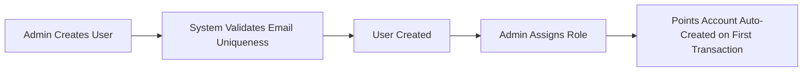
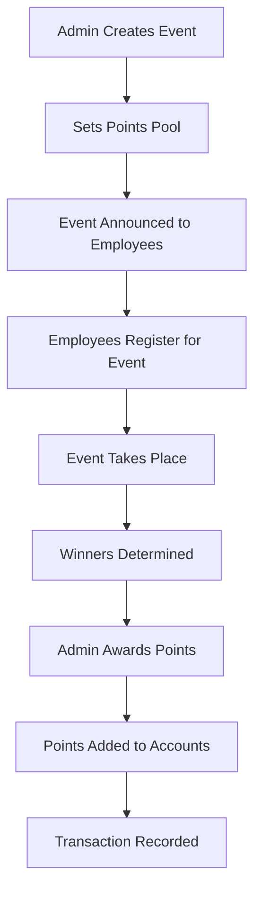
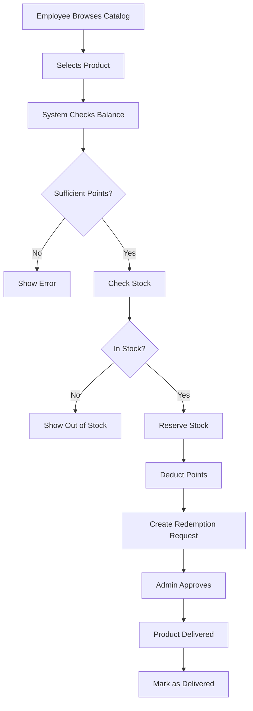
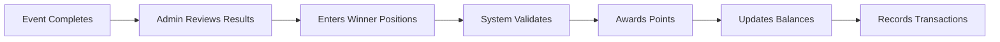

# Reward Points System - Complete Documentation

## Table of Contents
1. [System Overview](#system-overview)
2. [Architecture](#architecture)
3. [Core Entities](#core-entities)
4. [User Flows](#user-flows)
5. [Service Responsibilities](#service-responsibilities)
6. [Real-World Implementation](#real-world-implementation)
7. [Security & Validation](#security--validation)
8. [Data Persistence](#data-persistence)
9. [Future Enhancements](#future-enhancements)

---

## System Overview

The Reward Points System is a C# application designed to manage employee rewards through a points-based system. Employees can earn points by participating in company events and redeem them for products from a catalog.

### Key Features:
- **User Management**: Create and manage employee accounts with role-based access (Admin/Employee)
- **Event Management**: Create events with points pools for winners
- **Points System**: Award, track, and manage points balances
- **Product Catalog**: Manage redeemable products with inventory
- **Redemption Process**: Complete workflow from request to delivery

---

## Architecture

### Technology Stack
- **Language**: C# (.NET)
- **Architecture Pattern**: Clean Architecture with Domain-Driven Design (DDD)
- **Design Patterns**: 
  - Repository Pattern
  - Unit of Work Pattern
  - Service Layer Pattern
  - Orchestrator Pattern
- **Storage**: In-Memory (current), ready for database integration

### Layer Structure

```
RewardPointsSystem/
├── Domain/               # Core business entities and rules
│   ├── Entities/        # Business models
│   └── Exceptions/      # Custom domain exceptions
│
├── Application/         # Business logic and services
│   ├── Interfaces/     # Service contracts
│   ├── Services/       # Service implementations
│   └── DTOs/          # Data transfer objects
│
└── Api/                # Application entry point
    ├── Program.cs     # Main execution
    └── Configuration/ # DI setup
```

---

## Core Entities

### 1. User System

#### User Entity
- **Purpose**: Represents system users (employees/admins)
- **Key Properties**:
  - `Id`: Unique identifier (GUID)
  - `Email`: Unique email address
  - `FirstName`, `LastName`: User identification
  - `IsActive`: Account status
  - `CreatedAt`, `UpdatedAt`: Audit timestamps

#### Role Entity
- **Purpose**: Define system permissions
- **Types**: Admin, Employee
- **Properties**:
  - `Id`: Unique identifier
  - `Name`: Role name
  - `Description`: Role purpose
  - `IsActive`: Role status

#### UserRole Entity
- **Purpose**: Links users to roles (many-to-many)
- **Properties**:
  - `UserId`, `RoleId`: Composite key
  - `AssignedAt`, `AssignedBy`: Audit trail

### 2. Event System

#### Event Entity
- **Purpose**: Company events that award points
- **Properties**:
  - `Id`: Unique identifier
  - `Name`, `Description`: Event details
  - `EventDate`: When event occurs
  - `Status`: Upcoming/Active/Completed/Cancelled
  - `TotalPointsPool`: Available points to distribute
  - `CreatedBy`: Admin who created event

#### EventParticipant Entity
- **Purpose**: Track event registrations and awards
- **Properties**:
  - `EventId`, `UserId`: Links event and participant
  - `PointsAwarded`: Points given (null until awarded)
  - `Position`: Placement in event (1st, 2nd, etc.)
  - `RegisteredAt`, `AwardedAt`: Timestamps
  - `AwardedBy`: Admin who awarded points

### 3. Points Management

#### PointsAccount Entity
- **Purpose**: User's points wallet
- **Properties**:
  - `UserId`: Account owner
  - `CurrentBalance`: Available points
  - `TotalEarned`: Lifetime earned
  - `TotalRedeemed`: Lifetime spent

#### PointsTransaction Entity
- **Purpose**: Audit trail of all points movements
- **Properties**:
  - `UserId`: Transaction owner
  - `Points`: Amount
  - `Type`: Earned/Redeemed
  - `Source`: Event/Redemption
  - `SourceId`: Reference to source
  - `Description`: Transaction details
  - `Timestamp`: When occurred

### 4. Product & Redemption System

#### Product Entity
- **Purpose**: Items available for redemption
- **Categories**: Electronics, Gift Cards, Merchandise, Office Supplies, Other
- **Properties**:
  - `Name`, `Description`: Product details
  - `Category`: Product type
  - `ImageUrl`: Product image
  - `IsActive`: Availability status

#### ProductPricing Entity
- **Purpose**: Points cost of products (supports price changes)
- **Properties**:
  - `ProductId`: Linked product
  - `PointsCost`: Required points
  - `EffectiveFrom`, `EffectiveTo`: Price validity period

#### InventoryItem Entity
- **Purpose**: Stock management
- **Properties**:
  - `ProductId`: Linked product
  - `QuantityAvailable`: In stock
  - `QuantityReserved`: Held for pending redemptions
  - `ReorderLevel`: Low stock threshold

#### Redemption Entity
- **Purpose**: Product redemption requests
- **Status Flow**: Pending → Approved → Delivered (or Cancelled)
- **Properties**:
  - `UserId`, `ProductId`: Request details
  - `PointsSpent`: Points used
  - `Status`: Current state
  - `DeliveryNotes`: Fulfillment details

---

## User Flows

### 1. User Registration & Setup Flow



**Real-World Process:**
1. HR/Admin receives new employee information
2. Admin logs into system
3. Creates user account with employee details
4. Assigns appropriate role (typically Employee)
5. Employee receives credentials
6. Points account created automatically when they first earn points

### 2. Event Participation Flow



**Real-World Process:**
1. **Event Creation**: Management decides on quarterly sales competition with 1000 points pool
2. **Registration**: Employees sign up through the system
3. **Participation**: Sales competition runs for the quarter
4. **Results**: Sales figures determine winners
5. **Award Distribution**:
   - 1st place: 600 points
   - 2nd place: 400 points
6. **Automatic Updates**: Balances and transactions update instantly

### 3. Product Redemption Flow



**Classes Involved in Redemption:**
1. **RedemptionOrchestrator**: Coordinates entire flow
2. **PointsAccountService**: Validates and updates balance
3. **PricingService**: Gets current product cost
4. **InventoryService**: Checks and reserves stock
5. **TransactionService**: Records points deduction
6. **UnitOfWork**: Persists all changes

**Real-World Example:**
- Employee has 900 points
- Wants wireless headphones (500 points)
- System validates balance ✓
- Checks stock (20 available) ✓
- Reserves 1 unit
- Deducts 500 points
- Creates pending redemption
- Admin reviews and approves
- IT/Procurement delivers item
- System marked as delivered

### 4. Event Award Distribution Flow



**Classes Involved:**
1. **EventRewardOrchestrator**: Main coordinator
2. **EventService**: Validates event status
3. **EventParticipationService**: Verifies participants
4. **PointsAwardingService**: Manages pool and awards
5. **PointsAccountService**: Updates balances
6. **TransactionService**: Creates audit trail

---

## Service Responsibilities

### Core Services

#### UserService
- Create new users with validation
- Prevent duplicate emails
- Update user information
- Deactivate accounts
- Retrieve user details

#### RoleService & UserRoleService
- Manage system roles
- Assign roles to users
- Track who assigned roles and when

#### EventService
- Create and manage events
- Update event status
- Track points pools
- Retrieve upcoming/active events

#### EventParticipationService
- Register participants for events
- Verify registrations
- Track participation history
- Remove participants if needed

#### PointsAwardingService
- Award points to winners
- Track remaining pool
- Prevent duplicate awards
- Maintain award history

#### PointsAccountService
- Create and manage accounts
- Add/deduct points
- Check balances
- Validate sufficient funds

#### TransactionService
- Record all points movements
- Maintain audit trail
- Generate transaction history
- Support reporting

#### ProductCatalogService
- Manage product listings
- Update product details
- Activate/deactivate products
- Search and filter products

#### PricingService
- Set product prices in points
- Handle price changes over time
- Get current pricing
- Support price history

#### InventoryService
- Track stock levels
- Reserve items for redemptions
- Release reservations on cancellation
- Alert on low stock

### Orchestrator Services

#### RedemptionOrchestrator
Coordinates complex redemption flow:
1. Validates user account exists
2. Gets product price
3. Checks balance sufficiency
4. Verifies stock availability
5. Reserves inventory
6. Deducts points
7. Creates redemption record
8. Records transaction

#### EventRewardOrchestrator
Manages event reward distribution:
1. Validates event status
2. Verifies participation
3. Checks points pool
4. Awards points
5. Updates balances
6. Records transactions

---

## Real-World Implementation

### Typical Company Scenario

**Company**: AGDATA Technologies (100 employees)

**User Types:**
- 3 HR Admins (manage system)
- 97 Employees (participate and redeem)

**Monthly Events:**
1. **Sales Competition** (1000 points pool)
   - Top 3 sales performers win
   - Points: 600, 300, 100

2. **Training Completion** (500 points pool)
   - All who complete training get points
   - 50 points per person

3. **Innovation Challenge** (2000 points pool)
   - Best ideas win
   - Points: 1000, 600, 400

**Product Catalog:**
- **Electronics**: Laptops (2000 pts), Headphones (500 pts), Keyboards (300 pts)
- **Gift Cards**: Amazon (250 pts), Starbucks (100 pts)
- **Merchandise**: Company swag (50-200 pts)
- **Office Supplies**: Premium items (100-500 pts)

**Monthly Flow:**
1. **Start of Month**: Admin creates events
2. **Mid-Month**: Employees participate
3. **End of Month**: Winners announced, points awarded
4. **Ongoing**: Employees browse and redeem products

### Business Rules

1. **Point Expiry**: Points don't expire (configurable)
2. **Redemption Limits**: No daily limits (configurable)
3. **Approval Workflow**:
   - < 500 points: Auto-approved
   - ≥ 500 points: Admin approval required
4. **Stock Management**:
   - Auto-alert when stock < reorder level
   - Reserved items held for 48 hours
5. **Event Rules**:
   - Must register before event starts
   - Can't award more than pool amount
   - Winners announced within 3 days

---

## Security & Validation

### Input Validation
- Email format and uniqueness
- Required field validation
- Range validation (points > 0)
- String length limits
- URL format validation

### Business Rule Validation
- Sufficient balance checks
- Stock availability
- Event status verification
- Duplicate prevention (users, awards)
- Role-based access control

### Audit Trail
- User creation/updates tracked
- All point movements recorded
- Role assignments logged
- Redemption status changes tracked
- Event modifications logged

---

## Data Persistence

### Current: In-Memory Storage
- Uses `List<T>` collections
- Data persists during runtime only
- Implements Repository pattern
- Unit of Work for transactions

### Future: Database Integration
Ready for:
- SQL Server/PostgreSQL
- Entity Framework Core
- Same repository interfaces
- Migration scripts prepared

---

## Future Enhancements

### Phase 2 Possibilities

1. **Advanced Features**
   - Points expiry system
   - Point transfer between users
   - Team-based events
   - Bonus multipliers

2. **Reporting & Analytics**
   - Dashboard for metrics
   - Leaderboards
   - Redemption trends
   - Event participation rates

3. **Integration Capabilities**
   - HR system integration
   - Email notifications
   - Mobile app API
   - Third-party reward providers

4. **Gamification**
   - Badges and achievements
   - Levels and tiers
   - Streak bonuses
   - Referral rewards

5. **Automation**
   - Scheduled events
   - Automatic point distribution
   - Birthday/anniversary bonuses
   - Performance-based awards

6. **Enhanced Security**
   - Two-factor authentication
   - Detailed permission system
   - API rate limiting
   - Fraud detection

---

## System Health & Monitoring

### Key Metrics to Track
- Active users count
- Points in circulation
- Redemption success rate
- Average event participation
- Stock turnover rate
- System response times

### Alerts to Configure
- Low inventory warnings
- Large redemption requests
- Unusual point movements
- Failed transactions
- System errors

---

## Conclusion

The Reward Points System provides a complete solution for managing employee rewards. Its clean architecture ensures:
- **Maintainability**: Clear separation of concerns
- **Scalability**: Ready for database and feature expansion
- **Reliability**: Comprehensive validation and error handling
- **Auditability**: Complete transaction history
- **Flexibility**: Easily configurable business rules

The system is production-ready for small to medium organizations and can scale with additional features as needed.